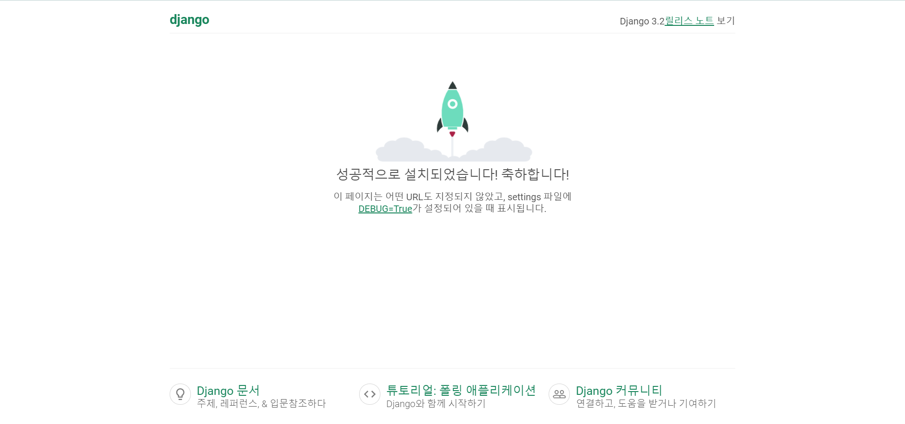

# (가칭) MAEMAE LOG
> 매매일지 기반의 소셜 네트워크 서비스<br />
> MVP 제작 프로젝트의 일환으로 구성

상세 내용 [Notion - 금융 SNS](https://www.notion.so/efete/SNS-59545958efd14e3cb48d2d7c2ad17691) 참조

## 프로젝트 시작 방법
> terminal에서 진행하는 것을 가정<br />
> 파이참에서는 아래 순서에 따른 설정을 개별 메뉴로 진행
### 1. 로컬에 프로젝트 폴더 생성
```shell
# project name: maemaelog
mkdir maemaelog
cd maemaelog
```
### 2. 파이썬 가상환경 생성
```shell
# virtual environment name: maemaelog
virtualenv maemaelog

# Window
.\maemaelog\Scripts\activate

# Mac
source maemaelog/bin/activate
```

### 3. github에서 프로젝트 repository clone
```shell
# 현재 폴더를 루트 폴더로 하기 위해 마지막에 . 붙임
git clone https://github.com/the-monple/maemaelog.git .
```

### 4. 필요한 파이썬과 노드 패키지 설치
```shell
pip install -r requirements.txt
npm install
```

### 5. 환경 변수 추가
**Slack**에서 받은 `.env` 파일을 프로젝트 루트 폴더에 추가

### 6. django 프로젝트 구동 테스트
```shell
# run django development server
python manage.py runserver
```
웹 브라우저를 열고 http://127.0.0.1:8000/ 또는 http://localhost:8000/ 을 통해 장고 초기 화면 확인



### 7. 새로운 브랜치 생성 후 브랜치로 이동하여 작업 시작
#### Option 1 - create new branch and check out separately
```shell
# create new branch
git branch <branch-name>

# check out(change to) new branch
git checkout <branch-name>
```
#### Option 2 - create and check out at once with `-b` option
```shell
# create new branch and check out at once
git checkout -b <branch-name>
```